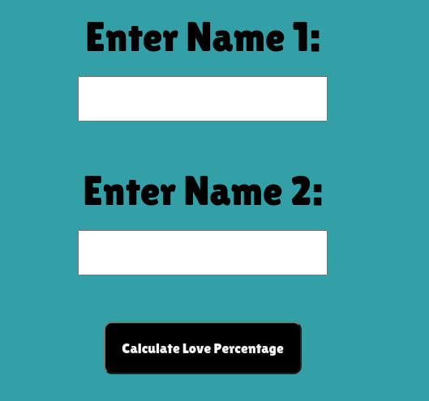
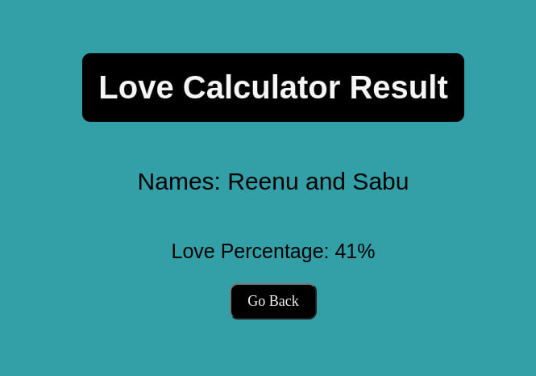

## Link
https://love-calc.onrender.com/?

This is a basic love calculator inspired from Mehar ikka 😂

Currently have built the Frontend using HTML & CSS and used flask for backend.

# Future Additions
- Planning to build the frontend using React.
- Will collect the data entered and if for the second time, the same data is entered, will fetch the percentage from the database, rather than calculating it again. 
- Will improve the algorithm with which the percentage is calculated.